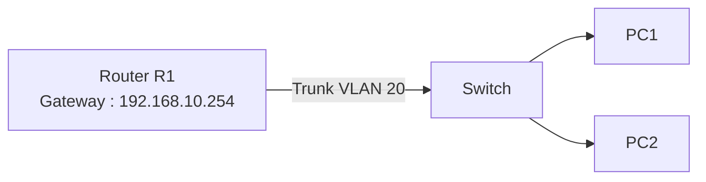

# From lesson inter-Vlan routing
## Requirements
* SW1 with 2 PCS (on the same VLAN)
* R1 (C7200)


1. First create the vlan for PCs on SW1
```console
vlan database
vlan 20 name Computers
exit
!
configure t
interface range fa1/0 -1
switchport mode access
switchport access vlan 20
no shutdown
exit
!
```

2. Set the trunk between SW1 and R1
```console
interface fa 1/2
switchport trunk encapsulation dot1q
switchport mode trunk
switchport trunk allowed vlan add 20
```

3. Handle the connection on the router
```bash
configure t
interface fa0/0.20 # because it is a virtual connection
encapsulation dot1q 20
ip address 192.168.10.254 255.255.255.0 # has to be in the same network as PC
exit
!
interface fa0/0
no shutdown
exit
!
show ip route
show ip interface brief # verification 
```

4. Create an IP Address on PC1 (same network as the default gateway) and send ping from R1 to that address, to verify
